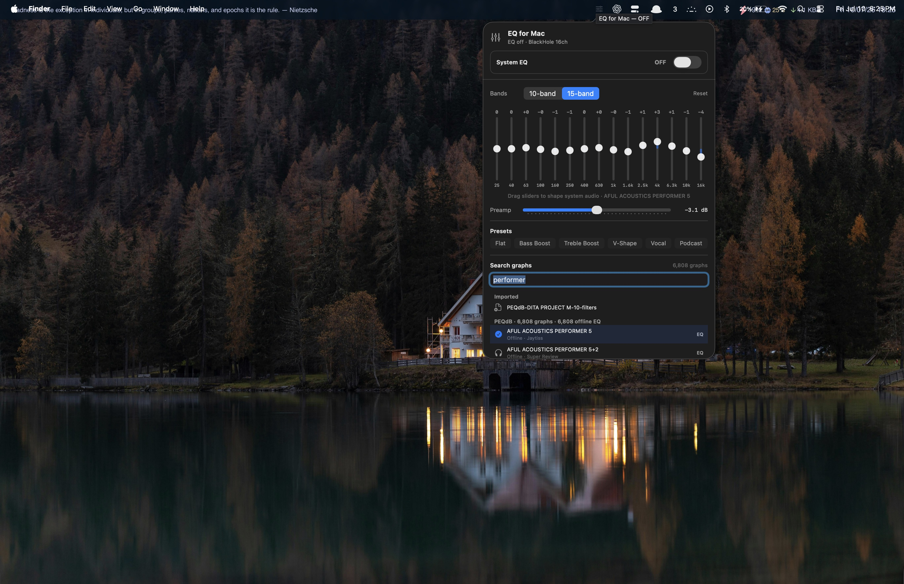
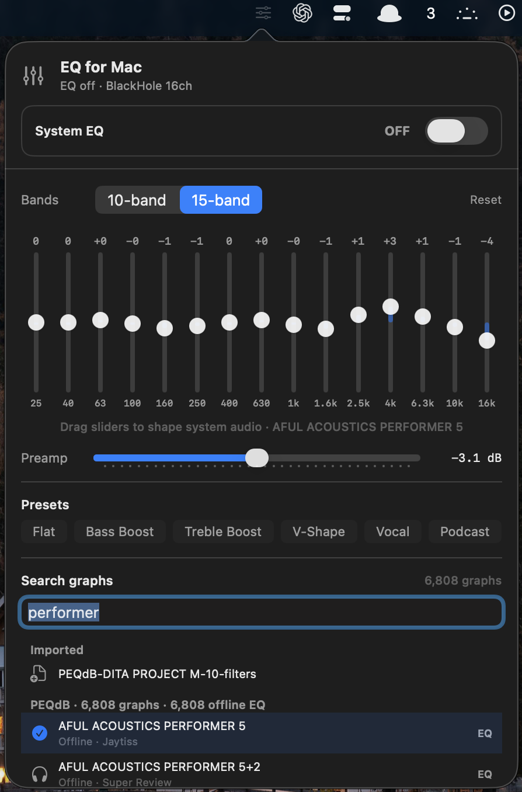
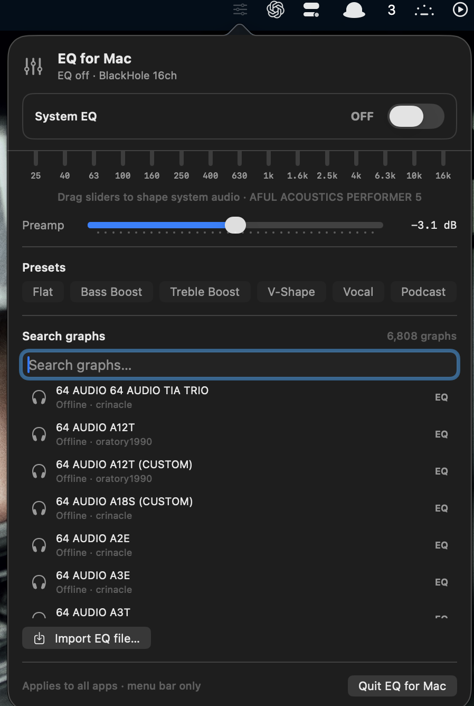

# EQ for Mac

A **menu-bar** system-wide equalizer for macOS. Once EQ is on, it shapes **all** audio leaving your Mac — browser, Spotify, Apple Music, YouTube Music, video players, games, notifications — everything.

No virtual audio driver required. Uses **Core Audio Taps** (macOS 14.2+).

Thank you to [Sharur](https://www.youtube.com/@Sharur) and [PEQdB](https://peqdb.com) for the inspiration to take on a project like this.

---

## Screenshots

### Menu bar panel



*Lives in the menu bar — no Dock icon, no full-window app.*

### 15-band EQ + headphone search



*Drag faders, apply genre presets, or search ~6,800 offline headphone curves.*

### Offline catalog & import



*Browse the full offline catalog or import your own Equalizer APO / PEQdB / AutoEQ `.txt` file.*

---

## Features

| Feature | Description |
|--------|-------------|
| **10- or 15-band graphic EQ** | Drag faders; changes apply live to system audio |
| **6,808 offline headphone presets** | Searchable catalog (PEQdB graph names + AutoEQ models) — no internet needed |
| **Import EQ files** | Equalizer APO / PEQdB / AutoEQ parametric `.txt` |
| **Genre presets** | Flat, Bass Boost, Treble Boost, V-Shape, Vocal, Podcast, … |
| **On / Off** | Bypass processing instantly without quitting |
| **Menu bar only** | Status item + popover; right-click or footer to quit |

---

## Requirements

- macOS **14.2** or newer (Core Audio Process Taps)
- **Xcode Command Line Tools** (to build from source):  
  `xcode-select --install`
- **Screen & System Audio Recording** permission (macOS groups system-audio taps under this privacy setting)

---

## Install (build from source)

This repo ships **source + offline EQ data**. There is no prebuilt binary in the repository (keeps the project small and easy to fork). Building produces a normal macOS app in `~/Applications`.

```bash
git clone <your-repo-url> eq_for_mac
cd eq_for_mac
chmod +x install.sh
./install.sh
open ~/Applications/EQ\ for\ Mac.app
```

`install.sh` runs a **release** Swift build, wraps the binary in `EQ for Mac.app`, ad-hoc codesigns it, and installs to `~/Applications`.

### Run without installing

```bash
swift run
```

### Permission

On first enable, macOS may ask for **Screen & System Audio Recording**.

If audio stays silent or EQ never starts:

1. **System Settings → Privacy & Security → Screen & System Audio Recording**
2. Enable **EQ for Mac**
3. Toggle EQ off and on again in the panel

If Gatekeeper blocks an unsigned build:

```bash
xattr -dr com.apple.quarantine ~/Applications/EQ\ for\ Mac.app
```

### Future prebuilt releases (optional)

Once this project is on GitHub, you can attach a zipped `EQ for Mac.app` to a **GitHub Release** so non-developers can download without building. Until then, `./install.sh` is the supported path.

---

## How to use

| Action | How |
|--------|-----|
| Open panel | **Left-click** the menu bar slider icon |
| Quit | **Right-click** the icon → **Quit EQ for Mac**, or use the panel footer / **⌘Q** |
| Enable EQ | Flip the **System EQ** switch |
| 10 vs 15 bands | Segmented control at the top of the panel |
| Genre presets | Chips under the faders (Bass Boost, Vocal, …) |
| Headphones | Search graphs → click a model |
| Custom curve | **Import EQ file…** |
| Reset | **Reset** (flat / 0 dB) |

---

## Offline data

Everything needed to run ships in the repo:

| Asset | Notes |
|--------|--------|
| `Sources/EQForMac/Resources/autoeq/*.txt` | ~6,015 parametric EQ curves |
| `Sources/EQForMac/Resources/headphones_catalog.json` | Search index (~6,808 entries) |
| `Sources/EQForMac/Resources/graph_names.txt` | PEQdB-style graph name list |
| Installed app | Typically **~20–25 MB** on disk after `./install.sh` |

No network is required to search or apply a bundled preset.

### Measurement / curve sources

1. **[AutoEq](https://github.com/jaakkopasanen/AutoEq)** — published parametric EQ files (primary)
2. **[Squiglink](https://squig.link)** network — public FR files converted offline to Harman-target PEQ (`scripts/fill_from_squig.py`)
3. **[PEQdB Studio](https://peqdb.com/studio/)** — public graph index / archive (`scripts/fill_from_peqdb_archive.py`)
4. **[graph.hangout.audio](https://graph.hangout.audio)** (Crinacle) — via PEQdB’s public archive where applicable

Equalizer APO / AutoEQ / PEQdB text format example:

```text
Preamp: -6.3 dB
Filter 1: ON LSC Fc 105 Hz Gain 6.3 dB Q 0.70
Filter 2: ON PK Fc 169 Hz Gain -2.1 dB Q 0.77
…
```

---

## Architecture (short)

```text
App audio ──► (muted) CATap ──► Aggregate device IOProc
                                      │
                                      ▼
                                 Ring buffer
                                      │
                                      ▼
                            AVAudioSourceNode
                                      │
                                      ▼
                              AVAudioUnitEQ
                                      │
                                      ▼
                              Peak limiter
                                      │
                                      ▼
                              Output device
```

The tap mutes the direct path to the speakers so you only hear the processed stream. The EQ process is excluded from the tap so the engine does not silence itself.

---

## Project layout

```text
eq_for_mac/
├── Package.swift                 # SwiftPM package
├── install.sh                    # Release build → ~/Applications/EQ for Mac.app
├── README.md
├── docs/images/                  # Screenshots for this README
├── scripts/                      # Offline catalog fill / backfill tools
└── Sources/EQForMac/
    ├── AppDelegate.swift         # Menu-bar app entry
    ├── MenuBarController.swift   # Status item, popover, quit
    ├── EQPopoverView.swift       # SwiftUI panel
    ├── EQViewModel.swift         # State + presets bridge
    ├── AudioEngine.swift         # CATap + AVAudioEngine EQ
    ├── AudioRingBuffer.swift
    ├── CoreAudioHelpers.swift
    ├── EQModels.swift
    ├── EqualizerAPOParser.swift  # AutoEQ / PEQdB text parser
    ├── PresetStore.swift
    ├── VerticalSlider.swift
    ├── Info.plist
    └── Resources/                # Catalog + bundled .txt curves
```

---

## Develop / customize

Clone, edit Swift under `Sources/EQForMac/`, then:

```bash
swift build
# or reinstall the app bundle:
./install.sh && open ~/Applications/EQ\ for\ Mac.app
```

Useful starting points:

| Want to… | Look at |
|----------|---------|
| Change UI layout / labels | `EQPopoverView.swift` |
| Add genre presets | `EQModels.swift` / `EQViewModel.swift` |
| Audio pipeline / latency | `AudioEngine.swift` |
| Parse more EQ file formats | `EqualizerAPOParser.swift` |
| Catalog loading | `PresetStore.swift` |

Regenerating the offline catalog (optional, for maintainers) needs Python + the AutoEq library; see comments in `scripts/`.

---

## Limitations

- Requires macOS **14.2+** (no fallback virtual driver in this project).
- Some DRM / protected paths may behave differently depending on OS version and app.
- Bluetooth devices can glitch briefly when switching outputs; the engine reconnects automatically.
- Builds are **ad-hoc signed** (not notarized). Gatekeeper may warn; use `xattr` as above if needed.

---

## Credits

- **[Sharur](https://www.youtube.com/@Sharur)** and **[PEQdB](https://peqdb.com)** — inspiration for headphone graph EQ workflows.
- **[AutoEq](https://github.com/jaakkopasanen/AutoEq)** — parametric EQ data and tooling.
- Squiglink / measurement communities — FR data used where applicable.

---

## License

App source in this repository: free to use, modify, and share for personal and community projects.

Bundled EQ curves are derived from [AutoEq](https://github.com/jaakkopasanen/AutoEq), Squiglink, and [PEQdB](https://peqdb.com/studio/) measurements — respect those projects’ credits and terms when redistributing curves.
