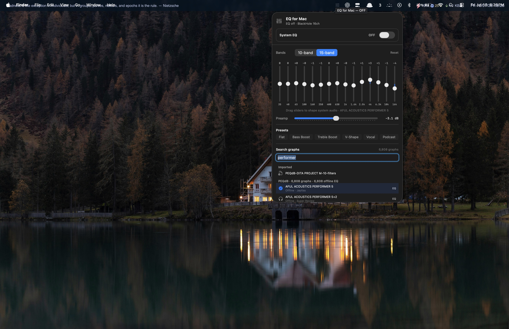
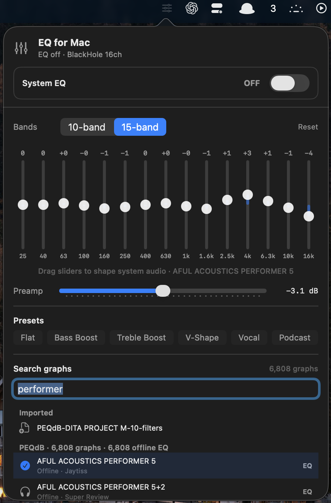
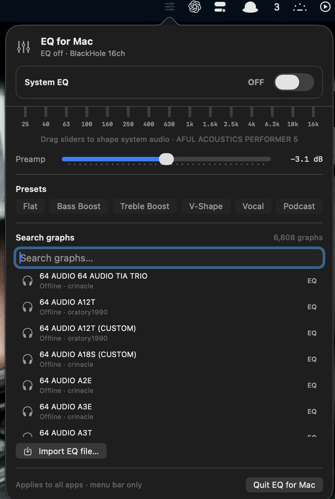

# EQ for Mac

A menu-bar equalizer for the whole Mac. Turn it on and it shapes everything you
hear — browser, Spotify, Apple Music, YouTube, video players, games — without
installing an audio driver.

- **Just want to use it?** Read [Install and use](#install-and-use).
- **Want to read or change the code?** Read [For developers](#for-developers).

Requirements: **macOS 14.2** or newer, on Apple silicon or Intel.

Thank you to [Sharur](https://www.youtube.com/@Sharur) and [PEQdB](https://peqdb.com)
for the inspiration to take on a project like this.

---

## Screenshots

### Menu bar panel



*Lives in the menu bar — no Dock icon, no full-window app.*

### Interactive EQ + headphone search



*Edit the exact response curve, apply presets, or search ~6,800 offline headphone curves.*

### Offline catalog & import



*Browse the full offline catalog or import any Equalizer APO / PEQdB / AutoEQ `.txt` file.*

---

## Features

| Feature | Description |
|--------|-------------|
| **Live spectrum + interactive curve** | See the signal, drag response points directly, hover for Hz/dB, or double-click a point to reset |
| **Exact owned DSP** | An Accelerate biquad cascade drives both the audio and displayed response |
| **Full offline correction catalog** | 6,808 searchable headphone entries, plus file import |
| **Fuzzy search, pins, and recents** | Forgiving compact-model search with favorite and recently applied headphone sections |
| **Import EQ files** | Equalizer APO / PEQdB / AutoEQ parametric `.txt` |
| **Built-in and personal presets** | Save, favorite, rename, reorder, and delete your own curves |
| **Clip-safe auto-preamp** | Computes the combined filter response and reserves headroom automatically or on demand |
| **Instant A/B** | Toggle bypass, or hold A/B to hear dry audio and release to resume processing |
| **Per-output profiles** | Remember a full EQ snapshot for an output device and restore it when that device becomes active |
| **Downmix compatibility** | Device-scoped capture preserves BlackHole's multichannel feed and applies EQ after Downmix's stereo render |
| **Headphone crossfeed** | Optional, focused spatial processing without duplicating macOS accessibility controls |
| **Menu-bar power tools** | Global ⌥⌘E toggle, option-click quick controls, scroll-to-adjust preamp, and Settings |
| **Guided permission setup** | Explains the macOS system-audio permission, opens the correct pane, and confirms it with a real engine probe |

---

# Install and use

No Terminal, no Xcode, no account. The download works on both Apple silicon and
Intel Macs.

### Step 1 — Download and install

1. **[Download EQ-for-Mac.zip](https://github.com/RavitejaKarra24/eq-for-mac/raw/main/EQ-for-Mac.zip)**
   (about 9 MB). The download starts immediately.
2. Open your **Downloads** folder. Safari unzips the file for you; in other
   browsers, double-click **EQ-for-Mac.zip** to unzip it. You end up with an app
   called **EQ for Mac**.
3. Drag **EQ for Mac** into your **Applications** folder, then double-click it
   there to open it.

### Step 2 — Get past the security warning (once)

**Expect a warning here. It is not a sign that anything is wrong.** macOS shows
it for every app that has not been through Apple's paid notarization service,
which costs $99 a year. This app is free and its complete source code is in this
repository, so it skips that step — and macOS asks you to confirm you meant to
open it.

**You only have to do this once.** After it, EQ for Mac opens normally forever.

1. macOS says it *could not verify* the app. Click **Done**. (Do not click
   **Move to Trash**.)
2. Open **System Settings** → **Privacy & Security**.
3. Scroll down to the **Security** section. You will see a line saying
   **"EQ for Mac" was blocked to protect your Mac**. Click **Open Anyway**
   beside it.
4. Authenticate with Touch ID or your Mac's password, then click **Open Anyway**
   in the confirmation box.

The **Open Anyway** button only appears for a few minutes after you tried to
open the app. If you don't see it, double-click EQ for Mac again and then go
back to Settings. This does not turn off any Mac security setting — it approves
this one app.

### Step 3 — Find the app

EQ for Mac has **no Dock icon and no window**. Look for a small **slider icon in
the menu bar**, at the top-right of your screen. Click it to open the panel.

### Step 4 — Allow it to hear your audio

To equalize sound, the app has to be able to read the audio your Mac is playing.
macOS files that permission under screen recording, so the name looks stranger
than what it does.

1. In the panel, follow the guided setup — it opens the right pane for you. Or
   open **System Settings** → **Privacy & Security** → **Screen & System Audio
   Recording** yourself.
2. Turn on the switch beside **EQ for Mac**.
3. Back in the panel, turn **System EQ** off and on again.

You should now hear the difference when you move a slider.

### Using it

| Action | How |
|--------|-----|
| Open panel | **Left-click** the menu bar slider icon |
| Quick controls | **Option-click** the icon |
| Adjust preamp without opening | **Scroll** over the menu bar icon |
| Quit | **Right-click** the icon → **Quit EQ for Mac**, or use the panel footer / **⌘Q** |
| Enable EQ | Flip the **System EQ** switch |
| Toggle from any app | Press **⌥⌘E** after enabling the global shortcut in Settings |
| Hear dry audio | Click **Bypass**, press **⌘B**, or hold **A/B** for a level-matched comparison |
| Shape the curve | Drag a node vertically for gain and horizontally for frequency; click empty space to add a parametric filter; right-click a node for type, bandwidth, or delete |
| Automatic headroom | Enable **Auto headroom**, or click **Match** beside the safe preamp value |
| Copy filters | Click the copy button beside the active preset to copy Equalizer APO text |
| Save a preset | **Save current** above the preset chips; right-click a saved chip to manage it |
| Headphones | Search graphs → click a model |
| Pin a headphone | Click the star at the right of its row |
| Custom curve | **Import EQ file…** |
| Remember an output | **Settings → Output profile → Remember EQ for this output** |
| Crossfeed | **Settings → Headphone listening** |
| Reset | **Reset** (flat / 0 dB) |

### Privacy

Audio is processed on your Mac and never leaves it. Nothing is recorded, saved,
or uploaded, and the app makes no network connections. Your presets are stored
in your own user library.

While the EQ is on, the app mutes the direct path to your output device so you
only hear the processed sound; turning the EQ off or quitting restores normal
audio immediately.

### Updating

There are no automatic updates. To update, quit EQ for Mac from the menu bar,
download the newest zip from this page, unzip it, drag the new **EQ for Mac**
into **Applications**, and click **Replace** when asked. The security warning
may appear again for the new copy — the same four clicks apply.

### Uninstalling

1. Click the menu bar icon and choose **Quit EQ for Mac**.
2. Open **Applications** and drag **EQ for Mac** to the Trash.

That is all of it. If you want to be thorough, you can also remove EQ for Mac
from **System Settings → Privacy & Security → Screen & System Audio Recording**.

### If something looks wrong

| What you see | What to do |
|---|---|
| The **Open Anyway** button isn't in Settings | It only shows for a few minutes after a blocked launch. Double-click the app again, then look. |
| Nothing happens when I open the app | It has no window or Dock icon by design. Look for the slider icon in the menu bar. |
| The menu bar icon isn't there | Your menu bar may be full — quit another menu bar app, or unhide it in your menu-bar manager. |
| Moving sliders changes nothing | Check that **System EQ** is on and **Bypass** is off, then confirm EQ for Mac is enabled under **Screen & System Audio Recording** and toggle the EQ off and on. |
| It asks for the audio permission again after an update | Expected. macOS ties that permission to an app's signature, and every new build of an un-notarized app is signed afresh. Re-enable it and toggle the EQ. |
| Audio cuts out briefly when switching devices | Changing output or reconnecting Bluetooth restarts the audio path. It settles on its own. |
| Music sounds distorted or clipped | Lower the preamp, or enable **Auto headroom** and click **Match**. |
| Using Downmix or BlackHole and EQ doesn't apply | Choose a real physical output inside Downmix, then toggle EQ off and on. |

---

# For developers

## Build and run from source

Requires the free Xcode Command Line Tools — no Apple ID, paid developer
account, or administrator access.

```bash
xcode-select --install                                  # once, if not present
git clone https://github.com/RavitejaKarra24/eq-for-mac.git
cd eq-for-mac
./install.sh
```

`install.sh` builds a release binary, assembles and ad-hoc signs
`EQ for Mac.app`, installs it at `~/Applications/EQ for Mac.app`, strips
quarantine metadata from that locally built app only, and opens it. It changes
no system-wide security setting.

A locally built app is never quarantined, so you will not see the Gatekeeper
prompt that the [Install and use](#install-and-use) section describes. To see
what users see, download the zip from GitHub on another Mac or a fresh user
account.

The audio permission still has to be granted by hand, once:
**System Settings → Privacy & Security → Screen & System Audio Recording** →
enable **EQ for Mac** → toggle the EQ off and on.

## Everyday commands

```bash
swift build                       # compile
swift test                        # Swift Testing suite
./install.sh                      # rebuild, reinstall to ~/Applications, launch
open "$HOME/Applications/EQ for Mac.app"    # launch later
git pull --ff-only && ./install.sh          # update a local checkout
scripts/package-zip.sh            # regenerate the committed download
pkill -x EQForMac; rm -rf "$HOME/Applications/EQ for Mac.app"   # uninstall
```

Tests use Swift Testing (`import Testing`) and need Xcode 16+ or an official
Swift toolchain that ships the Testing module; some standalone Command Line
Tools releases omit both Testing and XCTest, which is enough for `swift build`
and `./install.sh` but not for `swift test`.

## Distribution model

The download is a universal, **ad-hoc signed** zip committed at the repository
root, linked from the install section by its `…/raw/main/EQ-for-Mac.zip` URL so
the browser downloads it directly instead of landing on a GitHub file page.
Ad-hoc signing (`codesign --sign -`) is free and satisfies the Apple-silicon
requirement that every binary carry a signature; Apple notarization is
deliberately not used, because it requires a $99/year Developer Program
membership. The cost is a one-time **Open Anyway** detour for every person who
downloads it, which the install section documents in full.

Consequences worth knowing before changing anything here:

- `scripts/package-zip.sh` is the only supported way to regenerate the download.
  It builds universal, verifies the bundle signature, archives with
  `ditto -c -k --keepParent`, unpacks that archive to a temp directory and
  re-verifies the signature *there*, then moves it into place and prints the
  version, architectures, size, and SHA-256.
- **Never archive with `zip`.** It drops symlinks, resource forks, and extended
  attributes, which invalidates the code signature. On Apple silicon the result
  is not a warning — the app simply refuses to launch. `ditto` in CPIO-archive
  mode preserves all of it. If a tester reports "nothing happens when I open
  it", check this first.
- The zip lives at the repository root, outside the git-ignored `dist/`, so it
  is committed and directly linkable. It is currently ~9 MB; if it grows much
  past ~10 MB, or releases get frequent, attach it to a tagged GitHub Release
  instead and link to `/releases/latest` — every committed version stays in git
  history forever.
- **Bump the version and regenerate the zip in the same commit as any
  user-facing change.** `Sources/EQForMac/Info.plist` is the single source of
  truth for `CFBundleShortVersionString` and `CFBundleVersion`; both scripts
  read it. Git will not warn you that a checked-in build artifact is stale.
- Because ad-hoc signatures change between builds, macOS may re-prompt for the
  system-audio permission after an update. That is the strongest argument for
  eventually paying the $99 — see below.
- Please don't add notarization to the default path. It cannot run without
  credentials this project does not have, and a packaging script that fails for
  contributors is worse than a documented detour for users.

### Regenerating the download

```bash
scripts/package-zip.sh
```

That is the whole command. It writes `EQ-for-Mac.zip` at the repository root,
building universal (`arm64 x86_64`) with the version from `Info.plist`.
Overrides are available for anything else:

```bash
VERSION=1.2.3 BUILD_NUMBER=123 ARCHS=arm64 \
ZIP_PATH="$PWD/dist/EQ-for-Mac-test.zip" \
  scripts/package-zip.sh
```

### If this project ever gets a Developer ID

The migration is additive. Maintainers with a Developer ID Application
certificate can already produce a hardened-runtime, notarized, stapled build:

```bash
CODESIGN_IDENTITY="Developer ID Application: Example (TEAMID)" \
NOTARY_PROFILE="eq-for-mac-notary" \
  scripts/package-zip.sh
```

That path submits the archive to `notarytool`, staples the ticket to the `.app`,
and re-archives the stapled bundle, because a ticket cannot be stapled to a zip.

`NOTARY_PROFILE` is a keychain profile created beforehand with
`xcrun notarytool store-credentials`. Certificates and notarization credentials
are intentionally never stored in the repository. Once notarized builds are the
norm, delete Step 2 from the install section.

## Project layout

```text
eq-for-mac/
├── EQ-for-Mac.zip                # Committed download for non-technical users
├── Package.swift                 # SwiftPM package
├── install.sh                    # Build, install to ~/Applications, and launch
├── README.md
├── Tests/EQForMacTests/          # Parser, models, headroom, preset, ring-buffer tests
├── docs/images/                  # Screenshots for this README
├── scripts/build-app.sh          # Assemble and ad-hoc sign the app bundle
├── scripts/package-zip.sh        # Build, archive, and verify the distributable zip
├── scripts/                      # Offline catalog fill / backfill tools (Python)
└── Sources/EQForMac/
    ├── AppDelegate.swift         # Menu-bar app entry
    ├── MenuBarController.swift   # Status item, popover, quit
    ├── EQPopoverView.swift       # SwiftUI panel
    ├── EQCurveView.swift         # Interactive response + spectrum surface
    ├── EQViewModel.swift         # State + presets bridge
    ├── AudioEngine.swift         # CATap + owned real-time render graph
    ├── AudioRingBuffer.swift
    ├── BiquadProcessor.swift     # Allocation-free filter cascade
    ├── EQResponse.swift          # Shared RBJ coefficients + exact response
    ├── SpectrumAnalyzer.swift    # Off-render-thread vDSP FFT
    ├── StereoProcessor.swift     # Crossfeed + restart ramps
    ├── EQHeadroomCalculator.swift
    ├── SettingsView.swift
    ├── LoginItem.swift
    ├── HotKeyManager.swift
    ├── CoreAudioHelpers.swift
    ├── EQModels.swift
    ├── EqualizerAPOParser.swift  # AutoEQ / PEQdB text parser
    ├── EqualizerAPOExporter.swift
    ├── PresetStore.swift
    ├── Info.plist                # Source of truth for the shipped version
    └── Resources/                # Catalog + bundled .txt curves
```

Useful starting points:

| Want to… | Look at |
|----------|---------|
| Change UI layout / labels | `EQPopoverView.swift` |
| Add genre presets | `EQModels.swift` / `EQViewModel.swift` |
| Audio pipeline / latency | `AudioEngine.swift` |
| Parse more EQ file formats | `EqualizerAPOParser.swift` |
| Catalog loading | `PresetStore.swift` |
| Bundle assembly / signing | `scripts/build-app.sh` |

## Architecture (short)

```text
Output-device audio ──► (muted, device-scoped) CATap ──► Aggregate IOProc
                                      │
                       ┌──────────────┴──────────────┐
                       ▼                             ▼
                  Ring buffer                 Spectrum queue
                       │                       (Hann + vDSP FFT)
                       ▼
              AVAudioSourceNode
                       │
                       ▼
                  Crossfeed
                       │
                       ▼
          Owned RBJ biquad cascade
                       │
                       ▼
                  Peak limiter
                       │
                       ▼
                  Output device
```

The tap mutes the direct path to the selected output so you only hear the
processed stream. The EQ process is excluded from the tap so the engine does not
silence itself.

When **Downmix** uses BlackHole as the macOS default output, EQ for Mac resolves
Downmix's saved physical output and taps that device instead. This keeps the
16-channel BlackHole feed intact and places EQ after Downmix. Select a valid
physical output in Downmix, then toggle EQ off and on after changing that route.

## Offline data

Everything needed to run ships in the repo:

| Asset | Notes |
|--------|--------|
| `Sources/EQForMac/Resources/autoeq/*.txt` | Full bundled parametric-EQ catalog |
| `Sources/EQForMac/Resources/headphones/` | Curated, ready-to-use offline headphone corrections |
| `Sources/EQForMac/Resources/headphones_catalog.json` | Search index for the offline catalog |
| `Sources/EQForMac/Resources/graph_names.txt` | PEQdB-style graph-name fallback |
| `Sources/EQForMac/Resources/target_curves.json` | 17 reference-target metadata entries |
| `Sources/EQForMac/Resources/AppIcon.icns` | Multi-resolution macOS application icon |
| Installed app | Includes the complete catalog; no catalog download is required |

No network is required to search or apply a bundled preset. Regenerating the
offline catalog is optional and requires Python plus the AutoEq library; see the
scripts under `scripts/`.

### Measurement / curve sources

1. **[AutoEq](https://github.com/jaakkopasanen/AutoEq)** — published parametric EQ files (primary)
2. **[Squiglink](https://squig.link)** network — public FR files converted offline to Harman-target PEQ (`scripts/fill_from_squig.py`)
3. **[PEQdB Studio](https://peqdb.com/studio/)** — public graph index / archive (`scripts/fill_from_peqdb_archive.py`)
4. **[graph.hangout.audio](https://graph.hangout.audio)** (Crinacle) — via PEQdB's public archive where applicable

Reference-target metadata remains separate from headphone corrections until it
can be paired with compatible measurement samples accurately.

Equalizer APO / AutoEQ / PEQdB text format example:

```text
Preamp: -6.3 dB
Filter 1: ON LSC Fc 105 Hz Gain 6.3 dB Q 0.70
Filter 2: ON PK Fc 169 Hz Gain -2.1 dB Q 0.77
…
```

## Limitations

- Requires macOS **14.2+** (no fallback virtual driver in this project).
- Some DRM / protected paths may behave differently depending on OS version and app.
- Bluetooth/output changes are faded and debounced, but hardware reconnection
  can still produce a short gap.
- The download is ad-hoc signed rather than Apple-notarized, so macOS requires
  **Open Anyway** on first launch. There are no automatic updates.
- Launch at login uses `SMAppService` and must be exercised from the installed
  application bundle. macOS can require approval under **General → Login Items**;
  raw `swift run` executables cannot register.
- EQ applies to audio sent to the resolved output device. Independent per-app
  taps/profiles remain an advanced future engine mode.
- The initial install requires System Audio Recording permission. macOS may ask
  again after a materially changed rebuild, but not on ordinary launches.

---

## Credits

- **[Sharur](https://www.youtube.com/@Sharur)** and **[PEQdB](https://peqdb.com)** — inspiration for headphone graph EQ workflows.
- **[AutoEq](https://github.com/jaakkopasanen/AutoEq)** — parametric EQ data and tooling.
- Squiglink / measurement communities — FR data used where applicable.

## License

App source in this repository: free to use, modify, and share for personal and community projects.

Bundled EQ curves are derived from [AutoEq](https://github.com/jaakkopasanen/AutoEq), Squiglink, and [PEQdB](https://peqdb.com/studio/) measurements — respect those projects' credits and terms when redistributing curves.
